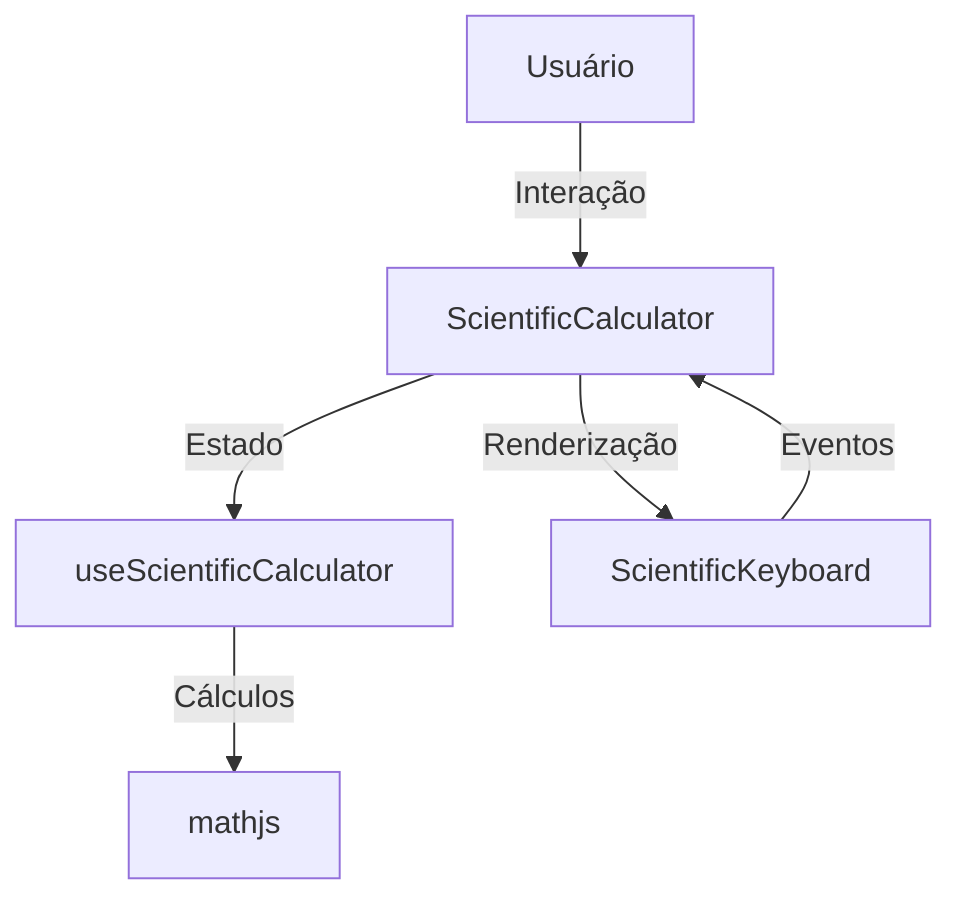

# Calculadora Científica - MolWise

## 📋 Visão Geral

A calculadora científica é um componente do MolWise que permite realizar cálculos matemáticos avançados. Ela foi implementada como uma extensão do sistema de calculadoras existente, mantendo a consistência visual e funcional com a calculadora de massa molar.

### 🎯 Objetivos

- Fornecer uma interface intuitiva para cálculos matemáticos avançados
- Manter consistência com o design system existente
- Suportar operações científicas comuns
- Garantir precisão nos cálculos
- Manter a acessibilidade

## 🏗️ Estrutura do Componente

### 📁 Organização de Arquivos

scientific/
├── README.md # Este arquivo
├── index.ts # Exportações dos componentes
├── ScientificCalculator.tsx # Componente principal
└── ScientificKeyboard.tsx # Componente do teclado

### 🔄 Fluxo de Dados



## 🚀 Guia de Implementação

### 1. Pré-requisitos

```bash
# Instalar dependências necessárias
npm install mathjs
```

### 2. Passos de Implementação

#### 2.1. Atualização dos Tipos

```typescript
// src/features/calculators/domain/types/calculator.ts
export type CalculatorType = "molar-mass" | "scientific";
```

#### 2.2. Implementação do Hook

```typescript
// useScientificCalculator.ts
interface UseScientificCalculatorProps {
  initialFormula?: string;
  initialResult?: string | null;
  onFormulaChange?: (formula: string) => void;
  onResultChange?: (result: string | null) => void;
}

export function useScientificCalculator({
  initialFormula = "",
  initialResult = null,
  onFormulaChange,
  onResultChange,
}: UseScientificCalculatorProps) {
  // Implementação do hook
}
```

#### 2.3. Implementação do Teclado

```typescript
// ScientificKeyboard.tsx
interface ScientificKeyboardProps {
  onKeyPress: (key: string) => void;
  onFunction: (func: string) => void;
  onMemory: (action: "store" | "recall" | "clear") => void;
  onCalculate: () => void;
  onBackspace: () => void;
}
```

#### 2.4. Implementação do Componente Principal

```typescript
// ScientificCalculator.tsx
interface ScientificCalculatorProps extends CalculatorBaseProps {
  id: number;
  initialFormula?: string;
  onFormulaChange?: (formula: string) => void;
  initialResult?: string | null;
  onResultChange?: (result: string | null) => void;
}
```

### 3. Atualização do Sistema de Tradução

```json
{
  "calculators": {
    "scientific": {
      "title": "Calculadora Científica",
      "subtitle": "Realize cálculos matemáticos avançados"
      // ... outras traduções
    }
  }
}
```

## 💡 Funcionalidades Implementadas

### 1. Operações Básicas

- [x] Adição, subtração, multiplicação, divisão
- [x] Potenciação
- [x] Raiz quadrada
- [x] Parênteses

### 2. Funções Científicas

- [x] Trigonométricas (sin, cos, tan)
- [x] Logarítmicas (log, ln)
- [x] Constantes (π, e)

### 3. Funções de Memória

- [x] M+ (Armazenar)
- [x] M- (Subtrair da memória)
- [x] MR (Recuperar)
- [x] MC (Limpar)

### 4. Interface

- [x] Campo de entrada com validação
- [x] Teclado numérico e científico
- [x] Exibição de resultados
- [x] Tratamento de erros
- [x] Interface responsiva
- [x] Suporte a arrastar e redimensionar

## 🧪 Guia de Testes

### 1. Testes Básicos

```typescript
// Exemplo de teste para operações básicas
describe("ScientificCalculator", () => {
  it("should perform basic operations correctly", () => {
    // Teste de adição
    expect(calculate("2 + 2")).toBe("4");

    // Teste de multiplicação
    expect(calculate("3 * 4")).toBe("12");

    // Teste de divisão
    expect(calculate("10 / 2")).toBe("5");
  });
});
```

### 2. Testes de Funções Científicas

```typescript
describe("Scientific Functions", () => {
  it("should calculate trigonometric functions", () => {
    expect(calculate("sin(0)")).toBe("0");
    expect(calculate("cos(0)")).toBe("1");
  });

  it("should handle mathematical constants", () => {
    expect(calculate("π")).toBe("3.141592653589793");
    expect(calculate("e")).toBe("2.718281828459045");
  });
});
```

### 3. Testes de Interface

- [ ] Verificar responsividade
- [ ] Testar redimensionamento
- [ ] Validar traduções
- [ ] Testar acessibilidade

## 🔧 Manutenção

### 1. Adicionar Novas Funções

Para adicionar uma nova função científica:

1. Atualizar o `functionMap` no hook
2. Adicionar o botão no teclado
3. Atualizar as traduções

### 2. Corrigir Bugs

1. Verificar logs de erro
2. Testar em diferentes navegadores
3. Validar cálculos com casos de borda

### 3. Atualizar Dependências

```bash
# Atualizar mathjs
npm update mathjs

# Verificar compatibilidade
npm audit
```

## ⚡ Considerações de Performance

### 1. Otimizações Implementadas

- Uso de `useCallback` para funções
- Memoização de componentes
- Validação de entrada
- Lazy loading de componentes

### 2. Boas Práticas

- Evitar recálculos desnecessários
- Limitar o tamanho do histórico
- Otimizar renderizações
- Gerenciar memória eficientemente

## 🔮 Próximos Passos Sugeridos

### 1. Melhorias de Funcionalidade

- [ ] Adicionar mais funções científicas
- [ ] Implementar histórico de cálculos
- [ ] Adicionar gráficos
- [ ] Implementar conversão de unidades

### 2. Melhorias de Interface

- [ ] Adicionar mais temas visuais
- [ ] Implementar atalhos de teclado
- [ ] Melhorar feedback visual
- [ ] Adicionar animações

### 3. Melhorias Técnicas

- [ ] Adicionar testes unitários
- [ ] Implementar testes E2E
- [ ] Melhorar cobertura de código
- [ ] Otimizar bundle size

## 🤝 Guia de Contribuição

### 1. Processo de Desenvolvimento

1. Criar branch a partir de `main`
2. Implementar feature/fix
3. Adicionar testes
4. Atualizar documentação
5. Criar PR

### 2. Padrões de Código

- Seguir ESLint
- Usar TypeScript
- Manter testes atualizados
- Documentar mudanças

### 3. Checklist de PR

- [ ] Código segue padrões
- [ ] Testes passam
- [ ] Documentação atualizada
- [ ] Sem conflitos
- [ ] Revisado por pares

## 📚 Recursos Adicionais

### 1. Documentação

- [Documentação do mathjs](https://mathjs.org/docs/)
- [Guia de TypeScript](https://www.typescriptlang.org/docs/)
- [Documentação do Next.js](https://nextjs.org/docs)

### 2. Ferramentas

- [ESLint](https://eslint.org/)
- [Jest](https://jestjs.io/)
- [React Testing Library](https://testing-library.com/)

### 3. Referências

- [Calculadora Científica HP](https://www.hp.com/)
- [Calculadora Casio](https://www.casio.com/)
